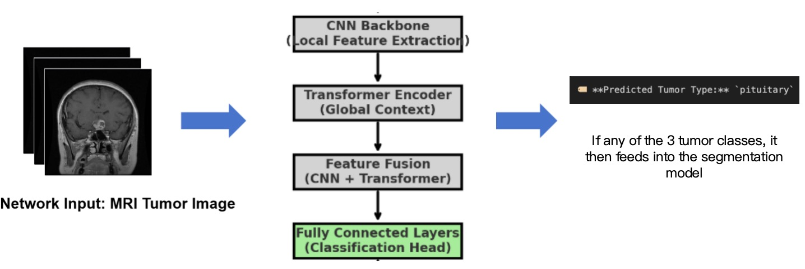

# AI-Powered Radiology Assistant


An end-to-end system that automates brain tumor diagnosis from MRI scans by combining deep learning for image analysis (classification + segmentation) with a fine-tuned LLaMA language model for structured report generation.

---

## 🚀 Features

- **Tumor Classification**: TransUNet-based CNN + Transformer to detect and categorize tumors into four classes (No Tumor, Glioma, Meningioma, Pituitary).  
- **Tumor Segmentation**: 2D U-Net to generate precise binary masks of tumor regions.  
- **Structured Report Generation**: LoRA-fine-tuned LLaMA pipeline with prompt engineering (few-shot, instruction-based, role-based) to produce Findings, Risk Assessment, and Treatment Recommendations.  
- **Lightweight Deployment**: 4-bit quantized Llama, modular codebase, Gradio interface for interactive use.  
---

## 📂 Repository Structure

```text
AI-Powered-Radiology-Assistant/
├── README.md
├── LICENSE
├── requirements.txt
├── .gitignore
├── download_weights.py        # (optional) fetch model weights automatically
├── src/                       # all application code in one place
│   ├── __init__.py
│   ├── app.py                 # Gradio interface & main pipeline
│   ├── utils.py               # helper functions (model loading, downloads)
│   ├── classification/        # tumor classification module
│   │   ├── __init__.py
│   │   └── transunet.py       # TransUNetClassifier definition
│   ├── segmentation/          # tumor segmentation module
│   │   ├── __init__.py
│   │   └── unet.py            # build_unet, metrics (dice, iou)
│   └── report/                # report-generation logic
│       ├── __init__.py
│       └── generator.py       # extract_structured_info, LLM wrapper
└── notebooks/                 # Jupyter notebooks for training & experiments
    ├── Tumor_Classification_Transunet_code.ipynb
    ├── Tumor_Segmentation_code.ipynb
    ├── Generate_Reports.ipynb
    ├── LLM_Train_Model.ipynb
    └── Model_Performance_Comparison.ipynb
```

## Installation
1. Clone this repository:
```text
git clone https://github.com/your-username/AI-Powered-Radiology-Assistant.git
cd AI-Powered-Radiology-Assistant
```

2. Install Python dependencies:
```text
pip install -r requirements.txt
```

3. (Optional) Download pre-trained weights:
```text
python download_weights.py
```

## Usage
Launch the Gradio demo:
```text
python src/app.py
```
- Open the link in your browser.
- Upload a brain MRI scan.
- View classification result, segmentation mask, and AI-generated report.

## Screenshots & Diagrams
### 1. **Classification Pipeline**

— CNN + Transformer feature fusion for tumor type prediction.

### 2. **Segmentation Pipeline**  
  
— 2D U-Net encoder–decoder architecture.

### 3. **Sample Results**
  
— Example MRI slices, ground truth masks, predicted masks, Dice scores.

### 4. **Report Generation Flow**  
  
— LLaMA + LoRA + prompt engineering stages.

## Contributing
1. Fork the repository.
2. Create a feature branch:
```text
git checkout -b feature/your-feature-name
```
3. Commit your changes:
```text
git commit -m "Add [short description of feature]"
```
4. Push to your fork and open a Pull Request.

Please ensure that:
- Code follows PEP8 style conventions.
- Public APIs are documented with docstrings.
- New features include appropriate unit tests.

## License
This project is licensed under the MIT License. See the LICENSE file for details.

## Contact
Tianshuai Gao
- Email: tg2935@columbia.edu
- GitHub: tianshuai-gao/AI-Powered-Radiology-Assistant

